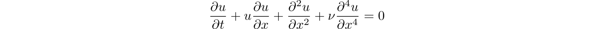
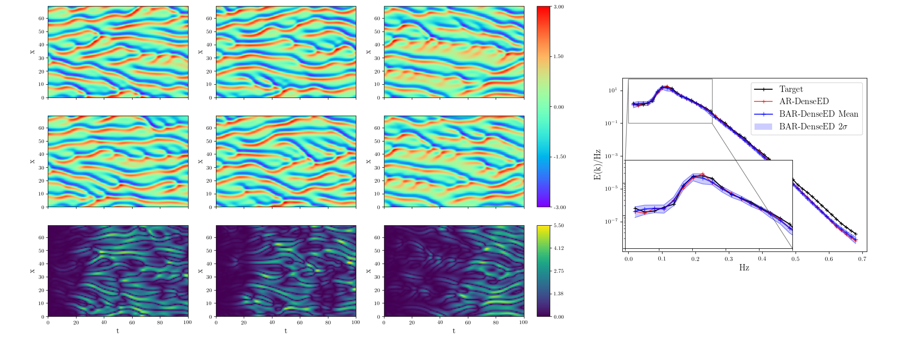

# Physics-Constrained Auto-Regressive Convolutional Neural Networks
Modeling the Dynamics of PDE Systems with Physics-Constrained Deep Auto-Regressive Networks [[JCP](https://doi.org/10.1016/j.jcp.2019.109056)][[ArXiv](https://arxiv.org/abs/1906.05747)]

[Nicholas Geneva](http://nicholasgeneva.com/), [Nicholas Zabaras](https://cics.nd.edu)

---
## Kuramoto-Sivashinsky Equation

This repository contains files pertaining to the modeling of the Kuramoto-Sivashinsky Equation.
The Kuramoto-Sivashinsky PDE has attracted great interest as it serves as a prototypical problem for studying complex dynamics with its chaotic regime being weakly turbulent  (as opposed to strong turbulence seen in the Navier-Stokes equations).





---
## Quick Start

### Training AR-DenseED

```
python main.py --epochs 100
```

### Training BAR-DenseED

If training from scratch:
```
python main.py --epochs 200 --swag-start 101
```
If starting from pre-trained determinisitic model:
```
python main.py --epochs 200 --swag-start 101 --epoch-start 100
```
Additional details of program parameters can be found in `args.py`.

### Generating Testing Data

To generate your own testing data run `solver/ksSolver.m` in Matlab.

Alternatively, one can download the testing data from [Notre Dame's Secure File Sharing Server](https://notredame.app.box.com/file/477538156270).
Move the compressed folder to the `./solver` folder, and extract its contents with:
```
tar -xvzf ar_pde_ksData.tar.gz
```

### Creating Figures

The following scipts can be used to generate the figures seen in the paper. Pre-trained models are provided which are found in `./post/networks`. Testing data is required for these figures, see previous section for details on how to obtain the appropriate data. 

All of the following programs are found in the `./post` folder.

**Figure 4**: Plot two Kuramoto-Sivashinsky simulations from test data.
```
python plotSpectralContour.py
```
**Figure 5**: Three test predictions of the Kuramoto-Sivashinsky equation using AR-DenseED.
```
python plotARContour.py
```
**Figure 6**: The average mean squared error (MSE) and energy squared error (ESE) as a function of time for a test set of 200 cases using AR-DenseED and predictive expectation of BAR-DenseED.
```
python plotMSE.py
```
**Figure 7**: The time-averaged spectral energy density of the simulated target, AR-DenseED deterministic prediction and BAR-DenseED empirical mean and standard deviation.
```
python plotESD.py
```
**Figure 8**: Samples from the posterior of BAR-DenseED.
```
python plotBARSamples.py
```

---
## Citation
Find this useful or like this work? Cite us with:
```latex
@article{geneva2019modeling,
  title = {Modeling the dynamics of {PDE} systems with physics-constrained deep auto-regressive networks},
  journal = {Journal of Computational Physics},
  pages = {109056},
  year = {2019},
  issn = {0021-9991},
  doi = {10.1016/j.jcp.2019.109056},
  url = {http://www.sciencedirect.com/science/article/pii/S0021999119307612},
  author = {Nicholas Geneva and Nicholas Zabaras}
}
```