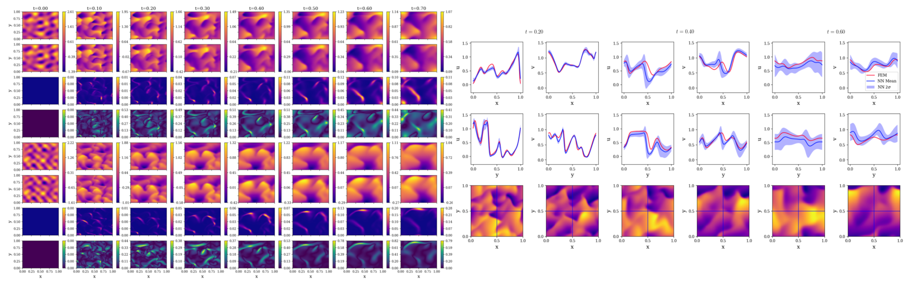

# Physics-Constrained Auto-Regressive Convolutional Neural Networks
Modeling the Dynamics of PDE Systems with Physics-Constrained Deep Auto-Regressive Networks [[JCP](https://doi.org/10.1016/j.jcp.2019.109056)][[ArXiv](https://arxiv.org/abs/1906.05747)]

[Nicholas Geneva](http://nicholasgeneva.com/), [Nicholas Zabaras](https://cics.nd.edu)

---
## 2D Coupled Burgers' Equation

The 2D coupled Burgers' equation is an excellent benchmark PDE due to both its non-linear term as well as diffusion operator, making it much more complex than the standard advection or diffusion equations.
The 2D coupled Burgers' belongs to a much broader class of PDEs that are related to various physical problems including shock wave propagation in viscous fluids, turbulence, super-sonic flows, acoustics, sedimentation and airfoil theory.
Given its similar form, the coupled Burgers' equation is often regarded as an essential stepping-stone to the full Navier-Stokes equations.




---
## Quick Start

### Training AR-DenseED

```
python main.py --epochs 100
```

### Training BAR-DenseED

If training from scratch:
```
python main.py --epochs 200 --swag-start 101
```
If starting from pre-trained determinisitic model:
```
python main.py --epochs 200 --swag-start 101 --epoch-start 100
```
Additional details of program parameters can be found in `args.py`.

### Generating Testing Data

Generate your own testing data using FEM using `solver/fenics_burgers2d.py` in Python. Note that you will require the [Fenics FEM package](https://fenicsproject.org/).
```
python fenics_burgers2D.py --istart 0 --iend 200
```
*For generating data for most plots, one only needs to run up to test case 15.*

**Note**: Due to the size of the produced data, we do not offer a direct download all FEM test data. Rather we offer direct download of only 20 test cases and validation cases from [Notre Dame's Secure File Sharing Server](https://notredame.box.com/s/wpd44fq7wwvh17icsizp19111u5bz9rv).

Move the compressed folder to the `./solver` folder, and extract its contents with:
```
tar -xvzf ar_pde_2dBurgerData.tar.gz
```

### Creating Figures

The following scipts can be used to generate the figures seen in the paper. Pre-trained models are provided which are found in `./post/networks`. Some testing data is required for these figures, see previous section for details on how to obtain the appropriate data. 

All of the following programs are found in the `./post` folder.

**Figure 16**: Plot five different initial states for the 2D coupled Burgers' equation.
```
python plotInitialState.py
```
**Figure 17**: Plot finite element simulation of the 2D coupled Burgers' equation.
```
python plotFEMContour.py
```
**Figure 18 and 19**: Plot two test predictions using AR-DenseED.
```
python plotARContour.py
```
**Figure 20**: The average mean squared error (MSE) and energy squared error (ESE) as a function of time for a test set of 200 cases using AR-DenseED and predictive expectation of BAR-DenseED.
```
python plotMSE.py
```
**Figure 21 and 22**: Samples from the posterior of BAR-DenseED.
```
python plotBARSamples.py
```
**Figure 23 and 24**: Plot the predictive expectation and variance of BAR-DenseED for two test cases.
```
python plotBARContour.py
```
**Figure 25**: Plot the predictive profiles of both velocity components for a test case at several different times using BAR-DenseED.
```
python plotProfiles.py
```

---
## Citation
Find this useful or like this work? Cite us with:
```latex
@article{geneva2019modeling,
  title = {Modeling the dynamics of {PDE} systems with physics-constrained deep auto-regressive networks},
  journal = {Journal of Computational Physics},
  pages = {109056},
  year = {2019},
  issn = {0021-9991},
  doi = {10.1016/j.jcp.2019.109056},
  url = {http://www.sciencedirect.com/science/article/pii/S0021999119307612},
  author = {Nicholas Geneva and Nicholas Zabaras}
}
```
