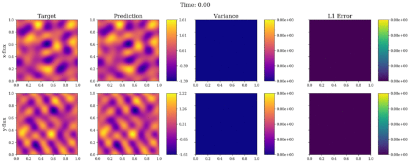
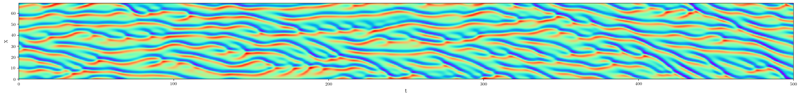

# Physics-Constrained Auto-Regressive Convolutional Neural Networks
Modeling the Dynamics of PDE Systems with Physics-Constrained Deep Auto-Regressive Networks [[JCP](https://doi.org/10.1016/j.jcp.2019.109056)][[ArXiv](https://arxiv.org/abs/1906.05747)]

[Nicholas Geneva](http://nicholasgeneva.com/), [Nicholas Zabaras](https://cics.nd.edu)

---

<center>

| Highlights | Bayesian 2D Coupled Burgers' Prediction |
| ------------- | ------------- |
|<ul><li>Zero Training Data</li><li>Surrogate Modeling</li><li>Deep Convolutional Networks</li><li>Non-linear Dynamics</li><li>Chaotic Systems</li><li>Bayesian Framework</li><li>100x Faster than FEM </li></ul> | |

</center>

> In this work, we propose a novel auto-regressive dense encoder-decoder convolutional neural network to solve and model transient systems with non-linear dynamics at a computational cost that is potentially magnitudes lower than standard numerical solvers. This model includes a Bayesian framework that allows for uncertainty quantification of the predicted quantities of interest at each time-step. We rigorously test this model on several non-linear transient partial differential equation systems including the turbulence of the Kuramoto-Sivashinsky equation, multi-shock formation and interaction with 1D Burgers’ equation and 2D wave dynamics with coupled Burgers’ equations.

## Index
Each of the PDE systems used in the paper is designated its own folder where more information can be found regarding modeling training, testing and figure replication.
- **1D-KS-SWAG**: The 1D Kuramoto-Sivashinsky system.
- **1D-Burger-SWAG**: The 1D viscous Burgers' system.
- **2D-Burgers-SWAG**: The 2D coupled Burgers' system.

<center>

| Deep Turbulence Generation |
| ------------- |
||

</center>

## Core Dependencies
* Python 3.6.5
* [PyTorch](https://pytorch.org/) 1.1.0
* [Fenics](https://fenicsproject.org/) 2019.1.0
* [Matplotlib](https://matplotlib.org/) 3.1.1

*Plus additional standard packages such as Numpy and Scipy*

## Citation
Find this useful or like this work? Cite us with:
```latex
@article{geneva2019modeling,
  title = {Modeling the dynamics of {PDE} systems with physics-constrained deep auto-regressive networks},
  journal = {Journal of Computational Physics},
  pages = {109056},
  year = {2019},
  issn = {0021-9991},
  doi = {10.1016/j.jcp.2019.109056},
  url = {http://www.sciencedirect.com/science/article/pii/S0021999119307612},
  author = {Nicholas Geneva and Nicholas Zabaras}
}
```